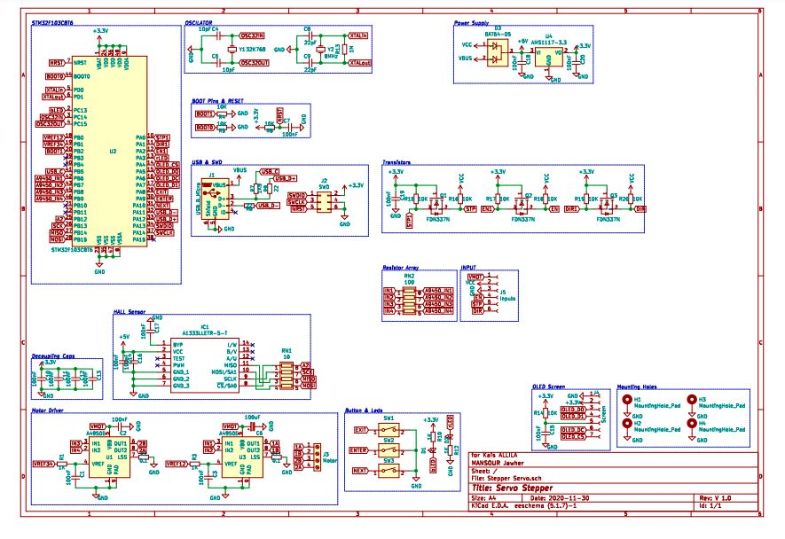

<h1 style="font-family: courier;" align="center">619-J_Stepper</h1>

<b>An open source closed loop stepper driver.</b>

# 619-J_Stepper
**619-J_Stepper** is an open source micro-controller board used to drive a stepper motor in closed loop mode. The board is generally used on 3D printer steppers or CNC steppers to prevent losing steps. The project is inspired by [**Tropical labs: Mechaduino board**](https://tropical-labs.com/mechaduino/).

Here the **features** of the **619-J_Stepper**:

* **STM32F103C8T6 ARM 32-bit Cortex™-M3** is the CPU of the board. Higher frequency, higher speed and cost-effictive.  

* **Magnetic encoder to Allegro's A1333LLETR-T** Contactless 0° to 360° angle sensor IC ,12bit

* **USB programming** and **serial communication** (serial version)

* High speed printing without losing steps.

* Ported the compilation platform from arduino to PlatformIO —— Convenient for STM32 MCU compilation

* This project support build and upload by platformio, you can use Atom or Code editor (need install platformio) build it or upload firmware.

* Cosed loop motor feedback.

Here are the schematic and the board:

# Manufacturing

After finishing the Routing and verify the pcb. We made the board at **[JLC PCB](https://jlcpcb.com/)**  and we chose also the PCB Assembly service which was very good.

Here is the **[BOM needed](https://github.com/FAB619/619-J_Stepper/blob/main/files/BOM_final.xlsx)** for jlcpcb assembly service:

| Designator | Quantity | value         | footprint                                                | LCSC Part                                                                                                                                                      |
| ---------- | -------- | ------------- | -------------------------------------------------------- | -------------------------------------------------------------------------------------------------------------------------------------------------------------- |
| U2         | 1        | STM32F103C8T6 | Package\_QFP:LQFP-48\_7x7mm\_P0.5mm                      | C8734                                                                                                                                                          |
| R4         | 1        | 10K           | 0402                                                     | C25744                                                                                                                                                         |
| Y1         | 1        | 32K768        | Crystal:Crystal\_SMD\_3215-2Pin\_3.2x1.5mm               | C252398                                                                                                                                                        |
| C5         | 1        | 10pF          | 0402                                                     |  C32949                                                                                                                                                        |
| C4         | 1        | 10pF          | 0402                                                     |  C32949                                                                                                                                                        |
| Y2         | 1        | 8MHz          | Crystal:Crystal\_SMD\_5032-2Pin\_5.0x3.2mm               |  C115962                                                                                                                                                       |
| C8         | 1        | 22pF          | 0402                                                     |  C1555                                                                                                                                                         |
| C9         | 1        | 22pF          | 0402                                                     |  C1555                                                                                                                                                         |
| R13        | 1        | 1M            | 0603                                                     | C22935                                                                                                                                                         |
| C7         | 1        | 100nF         | 0603                                                     | C14663                                                                                                                                                         |
| R5         | 1        | 10K           | 0402                                                     |  C25744                                                                                                                                                        |
| R8         | 1        | 10K           | 0402                                                     |  C25744                                                                                                                                                        |
| C10        | 1        | 100nF         | 0402                                                     | [ C1525](https://lcsc.com/product-detail/Multilayer-Ceramic-Capacitors-MLCC-SMD-SMT_SAMSUNG_CL05B104KO5NNNC_100nF-104-10-16V_C1525.html/?href=jlc-SMT)         |
| C11        | 1        | 100nF         | 0402                                                     | [ C1525](https://lcsc.com/product-detail/Multilayer-Ceramic-Capacitors-MLCC-SMD-SMT_SAMSUNG_CL05B104KO5NNNC_100nF-104-10-16V_C1525.html/?href=jlc-SMT)         |
| C12        | 1        | 100nF         | 0402                                                     | [ C1525](https://lcsc.com/product-detail/Multilayer-Ceramic-Capacitors-MLCC-SMD-SMT_SAMSUNG_CL05B104KO5NNNC_100nF-104-10-16V_C1525.html/?href=jlc-SMT)         |
| C13        | 1        | 100nF         | 0402                                                     | [ C1525](https://lcsc.com/product-detail/Multilayer-Ceramic-Capacitors-MLCC-SMD-SMT_SAMSUNG_CL05B104KO5NNNC_100nF-104-10-16V_C1525.html/?href=jlc-SMT)         |
| J1         | 1        | USB\_B\_Micro | Connector\_USB:USB\_Micro-AB\_Molex\_47590-0001          | C136001                                                                                                                                                        |
| R9         | 1        | 22            | 0402                                                     | [ C25092](https://lcsc.com/product-detail/Chip-Resistor-Surface-Mount_Uniroyal-Elec-0402WGF220JTCE_C25092.html/?href=jlc-SMT)                                  |
| R6         | 1        | 22            | 0402                                                     | [ C25092](https://lcsc.com/product-detail/Chip-Resistor-Surface-Mount_Uniroyal-Elec-0402WGF220JTCE_C25092.html/?href=jlc-SMT)                                  |
| R7         | 1        | 1K5           | 0402                                                     | [ C25867](https://lcsc.com/product-detail/Chip-Resistor-Surface-Mount_Uniroyal-Elec-0402WGF1501TCE_C25867.html/?href=jlc-SMT)                                  |
| D1         | 1        | LED           | 0603                                                     | [ C72041](https://lcsc.com/product-detail/Light-Emitting-Diodes-LED_0603-Blue-light_C72041.html/?href=jlc-SMT)                                                 |
| R10        | 1        | 1K            | 0402                                                     | [ C11702](https://lcsc.com/product-detail/Chip-Resistor-Surface-Mount_Uniroyal-Elec-0402WGF1001TCE_C11702.html/?href=jlc-SMT)                                  |
| D2         | 1        | LED\_Small    | 0603                                                     | [ C2286](https://lcsc.com/product-detail/Light-Emitting-Diodes-LED_Hubei-KENTO-Elec-KT-0603R_C2286.html/?href=jlc-SMT)                                         |
| R12        | 1        | 1K            | 0402                                                     | [ C11702](https://lcsc.com/product-detail/Chip-Resistor-Surface-Mount_Uniroyal-Elec-0402WGF1001TCE_C11702.html/?href=jlc-SMT)                                  |
| SW1        | 1        | SW\_DIP\_x01  | Button\_Switch\_SMD:SW\_Push\_SPST\_NO\_Alps\_SKRK       | [ C115357](https://lcsc.com/product-detail/Tactile-Switches_ALPS-Electric-SKRKAEE020_C115357.html/?href=jlc-SMT)                                               |
| SW2        | 1        | SW\_DIP\_x01  | Button\_Switch\_SMD:SW\_Push\_SPST\_NO\_Alps\_SKRK       | [ C115357](https://lcsc.com/product-detail/Tactile-Switches_ALPS-Electric-SKRKAEE020_C115357.html/?href=jlc-SMT)                                               |
| SW3        | 1        | SW\_DIP\_x01  | Button\_Switch\_SMD:SW\_Push\_SPST\_NO\_Alps\_SKRK       | [ C115357](https://lcsc.com/product-detail/Tactile-Switches_ALPS-Electric-SKRKAEE020_C115357.html/?href=jlc-SMT)                                               |
| D3         | 1        | BAT64-05      | eec:Infineon-BAT64-05-Level\_C                           | C779239                                                                                                                                                        |
| U4         | 1        | AMS1117-3.3   | Package\_TO\_SOT\_SMD:SOT-223-3\_TabPin2                 | [ C6186](https://lcsc.com/product-detail/Low-Dropout-Regulators-LDO_AMS_AMS1117-3-3_AMS1117-3-3_C6186.html/?href=jlc-SMT)                                      |
| C18        | 1        | 100nF         | 0603                                                     | C14663                                                                                                                                                         |
| C20        | 1        | 100nF         | 0603                                                     | C14663                                                                                                                                                         |
| C15        | 1        | 100nF         | 0603                                                     | C14663                                                                                                                                                         |
| R14        | 1        | 10K           | 0402                                                     |  C25744                                                                                                                                                        |
| Q1         | 1        | FDN337N       | FDN337N:ON\_Semi-527AG-01-12\_2008-O-IPC\_C              | [ C475694](https://lcsc.com/product-detail/MOSFET_Shikues-FDN337N_C475694.html/?href=jlc-SMT)                                                                  |
| R15        | 1        | 10K           | 0402                                                     |  C25744                                                                                                                                                        |
| C19        | 1        | 100nF         | 0603                                                     | C14663                                                                                                                                                         |
| R16        | 1        | 10K           | 0402                                                     |  C25744                                                                                                                                                        |
| Q3         | 1        | FDN337N       | FDN337N:ON\_Semi-527AG-01-12\_2008-O-IPC\_C              | [ C475694](https://lcsc.com/product-detail/MOSFET_Shikues-FDN337N_C475694.html/?href=jlc-SMT)                                                                  |
| R20        | 1        | 10K           | 0402                                                     |  C25744                                                                                                                                                        |
| R19        | 1        | 10K           | 0402                                                     |  C25744                                                                                                                                                        |
| Q2         | 1        | FDN337N       | FDN337N:ON\_Semi-527AG-01-12\_2008-O-IPC\_C              | [ C475694](https://lcsc.com/product-detail/MOSFET_Shikues-FDN337N_C475694.html/?href=jlc-SMT)                                                                  |
| R18        | 1        | 10K           | 0402                                                     |  C25744                                                                                                                                                        |
| R17        | 1        | 10K           | 0402                                                     |  C25744                                                                                                                                                        |
| C17        | 1        | 100nF         | 0603                                                     | C14663                                                                                                                                                         |
| C14        | 1        | 100nF         | 0603                                                     | C14663                                                                                                                                                         |
| C16        | 1        | 100nF         | 0603                                                     | C14663                                                                                                                                                         |
| RN1        | 1        | 10            | 0402                                                     | [C25496](https://lcsc.com/product-detail/Resistor-Networks-Arrays_Uniroyal-Elec-4D02WGJ0100TCE_C25496.html/?href=jlc-SMT)                                      |
| RN2        | 1        | 100           | 0402                                                     | [ C48442](https://lcsc.com/product-detail/Resistor-Networks-Arrays_Uniroyal-Elec-4D02WGJ0101TCE_C48442.html/?href=jlc-SMT)                                     |
| U1         | 1        | A4950E        | Package\_SO:SOIC-8-1EP\_3.9x4.9mm\_P1.27mm\_EP2.41x3.3mm | [ C82404](https://lcsc.com/product-detail/Motor-Drivers_Allegro-MicroSystems-LLC_A4950ELJTR-T_Allegro-MicroSystems-LLC-A4950ELJTR-T_C82404.html/?href=jlc-SMT) |
| R1         | 1        | 1K            | 0402                                                     | [ C11702](https://lcsc.com/product-detail/Chip-Resistor-Surface-Mount_Uniroyal-Elec-0402WGF1001TCE_C11702.html/?href=jlc-SMT)                                  |
| C1         | 1        | 100nF         | 0603                                                     | C14663                                                                                                                                                         |
| R2         | 1        | 0.1           | 1206                                                     | [ C25334](https://lcsc.com/product-detail/Chip-Resistor-Surface-Mount_Uniroyal-Elec-1206W4F100LT5E_C25334.html/?href=jlc-SMT)                                  |
| U3         | 1        | A4950E        | Package\_SO:SOIC-8-1EP\_3.9x4.9mm\_P1.27mm\_EP2.41x3.3mm | [ C82404](https://lcsc.com/product-detail/Motor-Drivers_Allegro-MicroSystems-LLC_A4950ELJTR-T_Allegro-MicroSystems-LLC-A4950ELJTR-T_C82404.html/?href=jlc-SMT) |
| C3         | 1        | 100nF         | 0603                                                     | C14663                                                                                                                                                         |
| R3         | 1        | 1K            | 0402                                                     | [ C11702](https://lcsc.com/product-detail/Chip-Resistor-Surface-Mount_Uniroyal-Elec-0402WGF1001TCE_C11702.html/?href=jlc-SMT)                                  |
| R11        | 1        | 0.1           | 1206                                                     | [ C25334](https://lcsc.com/product-detail/Chip-Resistor-Surface-Mount_Uniroyal-Elec-1206W4F100LT5E_C25334.html/?href=jlc-SMT)                                  |
| C6         | 1        | 100uF         | SMD-ECAP-6.3x5.3                                         | [ C176682](https://lcsc.com/product-detail/Aluminum-Electrolytic-Capacitors-SMD_Lelon-VZH101M1CTR-0605_C176682.html/?href=jlc-SMT)                             |
| C2         | 1        | 100nF         | 0603                                                     | C14663                                                                                                                                                         |

# Downloads

* [619-J_Stepper schematics](https://github.com/FAB619/619-J_Stepper/tree/main/files/Kicad%20Files)

* [619-J_Stepper board](https://github.com/FAB619/619-J_Stepper/tree/main/files/Kicad%20Files)

* [619-J_Stepper Step](https://github.com/FAB619/619-J_Stepper/blob/main/files/Stepper%20Servo.step)

* [619-J_Stepper BOM](https://github.com/FAB619/619-J_Stepper/blob/main/files/BOM_final.xlsx)

* [619-J_Stepper Position file](https://github.com/FAB619/619-J_Stepper/blob/main/files/Stepper%20Servo-all-pos.csv)

* [619-J_Stepper Gerber](https://github.com/FAB619/619-J_Stepper/tree/main/files/Manufacturing)

# Getting started

# License

The hardware is under the Creative Commons Attribution Share-Alike 4.0 License as much of the work is based on Mechaduino project by J. Church.

 Ce(tte) œuvre est mise à disposition selon les termes de la <a rel="license" href="http://creativecommons.org/licenses/by-nc-sa/4.0/">Licence Creative Commons Attribution - Pas d’Utilisation Commerciale - Partage dans les Mêmes Conditions 4.0 International</a>.

# Disclaimer

This hardware/software is provided "as is", and you use the hardware/software at your own risk. Under no circumstances shall any author be liable for direct, indirect, special, incidental, or consequential damages resulting from the use, misuse, or inability to use this hardware/software, even if the authors have been advised of the possibility of such damages.
